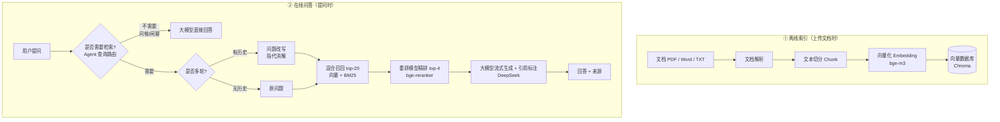

# 企业知识库 RAG 问答系统

基于 **LangChain + DeepSeek + 向量数据库** 的企业知识库智能问答系统。

上传公司制度文档（PDF / Word / TXT / Markdown），即可用自然语言提问，系统从文档中检索相关内容，并基于检索结果生成准确、可溯源的回答。

## ✨ 功能特性

- **完整 RAG 链路**：文档解析 → 文本切分 → 向量化 → 语义检索 → 大模型生成
- **结构感知切分**：按标题/章节切分 + 标题继承，块自包含章节信息，不被生硬截断
- **多轮对话**：通过「问题改写」实现指代消解，支持上下文追问（如「那请假呢？」）
- **混合检索 + 重排**：向量 + BM25 混合召回，再重排精排，正确率 25% → 100%（见下方评估数据）
- **多格式文档**：支持 PDF、Word（.docx）、TXT、Markdown
- **防幻觉**：系统提示词约束，资料中没有的内容不编造
- **引用高亮**：回答中标注引用编号，可点击跳转到具体原文片段
- **流式输出**：回答打字机效果，逐字实时返回
- **Agent 化查询路由**：大模型自主判断「是否需要检索」，问候/闲聊直接回答、跳过检索
- **对话历史持久化**：SQLite 存会话和消息，刷新页面不丢；侧边栏支持新建 / 切换 / 删除会话（历史消息连检索来源一起存）
- **用户登录**：JWT 认证 + 密码加盐哈希，注册/登录后使用；每个用户只看得到自己的会话（多用户隔离）
- **用户画像 / 长期记忆**：每轮聊完自动提取用户透露的个人信息（姓名、部门、偏好等）存成画像，下次提问时注入，跨会话记住用户是谁
- **Web 界面**：原生前端聊天界面，支持登录、上传文档、会话列表、流式输出、显示改写过程

## 🏗️ 架构图



## 🛠️ 技术栈

| 模块 | 技术 |
|------|------|
| 大模型 | DeepSeek（OpenAI 兼容 API） |
| 向量化（Embedding） | 硅基流动 · BAAI/bge-m3 |
| 重排（Rerank） | 硅基流动 · BAAI/bge-reranker-v2-m3 |
| 关键词检索（BM25） | rank-bm25 + jieba 中文分词 |
| 向量数据库 | ChromaDB（本地持久化） |
| 对话历史 / 用户画像存储 | SQLite（Python 内置 sqlite3，零依赖） |
| 用户认证 | JWT（PyJWT）+ PBKDF2 密码哈希 |
| 框架 | LangChain 1.x + FastAPI |
| 前端 | 原生 HTML / CSS / JavaScript |

## 📁 项目结构

```
CCDEMO/
├── .env                  # 密钥配置（已 gitignore，不上传）
├── .env.example          # 配置模板
├── README.md
├── frontend/
│   └── index.html        # 前端聊天界面
└── backend/
    ├── requirements.txt  # 依赖列表
    ├── app/
    │   ├── main.py       # FastAPI 入口
    │   ├── config.py     # 读取 .env 配置
    │   ├── routers/      # 接口路由（auth / rag / documents / chat / conversations）
    │   └── services/     # 核心业务逻辑
    │       ├── llm.py            # 大模型封装
    │       ├── embedding.py      # 向量化封装
    │       ├── hybrid.py         # 混合检索（向量 + BM25）
    │       ├── rerank.py         # 重排模型封装
    │       ├── document.py       # 文档解析 + 切分
    │       ├── vector_store.py   # 向量数据库
    │       ├── db.py             # SQLite 持久化（用户/画像 + 会话/消息）
    │       └── rag.py            # RAG 核心链路（查询路由→改写→检索→生成）
    ├── data/             # 示例文档 + 向量库数据
    └── test_*.py         # 各环节测试脚本
```

## 🚀 快速开始

### 1. 安装依赖

```bash
cd backend
python -m venv .venv              # 创建虚拟环境（首次）
# Windows 激活
.venv\Scripts\activate
# macOS / Linux 激活
source .venv/bin/activate

pip install -r requirements.txt
```

### 2. 配置密钥

复制 `.env.example` 为 `.env`，填入你的密钥：

```bash
cp .env.example .env
```

`.env` 内容：

```ini
# DeepSeek 大模型
DEEPSEEK_API_KEY=sk-xxx
DEEPSEEK_BASE_URL=https://api.deepseek.com
DEEPSEEK_MODEL=deepseek-chat

# 硅基流动 Embedding + 重排（DeepSeek 没有 Embedding 接口）
SILICONFLOW_API_KEY=sk-xxx
SILICONFLOW_BASE_URL=https://api.siliconflow.cn/v1
EMBEDDING_MODEL=BAAI/bge-m3
RERANK_MODEL=BAAI/bge-reranker-v2-m3

# JWT 登录（签发登录凭证的密钥，改成随机字符串）
JWT_SECRET=换成一段随机字符串
JWT_EXPIRE_MINUTES=10080
```

### 3. 启动后端

```bash
cd backend
uvicorn app.main:app --host 127.0.0.1 --port 8000
```

### 4. 打开前端

浏览器访问 <http://127.0.0.1:8000>，即可看到登录页：
注册一个账号（或登录）→ 上传文档 → 等索引完成 → 开始提问。

## 🔄 核心流程

### ① 离线索引（上传文档时）

```
文档 → 解析出纯文本 → 按章节切分成 Chunk → 每个 Chunk 向量化 → 存入 Chroma
```

- **切分**：结构感知切分——识别标题行（##、一、二、三、）当切分边界，按章节切块，并把章节标题注入到每个块里（避免上下文丢失）
- **向量化**：把文本转成 1024 维向量，语义相近的文本向量也相近

### ② 在线问答（提问时）

```
问题 → （Agent 判断是否检索）→ （多轮则先改写）→ 向量召回 → 重排精排 → 拼上下文 → 大模型生成
```

- **查询路由（Agent 化）**：大模型先判断「这个问题要不要查资料」。问候、闲聊、感谢等直接回答，跳过检索；涉及公司制度的问题才走完整检索
- **问题改写（多轮对话）**：把「那请假呢？」这类依赖上下文的问题，改写成独立问题「请假超过3天需要谁审批？」，才能正确检索
- **混合检索 + 重排（两阶段）**：
  - 召回：向量检索 + BM25 关键词检索，用 RRF 融合粗筛出 top-20
  - 重排：重排模型逐字精读问题与候选，重新排序取 top-4
- **防幻觉**：系统提示词强制「只能根据资料回答，没有就明说找不到」

## 📊 效果评估

用 12 个标准问答对做关键词匹配评估，对比「纯向量检索」与「向量 + 重排」：

| 方案 | 正确率 |
|------|--------|
| 纯向量检索（top-4） | 3 / 12（25%） |
| 混合检索（top-4） | 12 / 12（100%） |
| **混合检索 + 重排（top-4）** | **12 / 12（100%）** |

> 评估脚本：`backend/test_eval.py`（说明：评估集为手构造、关键词匹配，较粗略，用于展示各方案的相对提升）
>
> 采用结构感知切分（按标题 + 标题继承）后，混合检索也从 92% 提升到了 100%：块更干净、且自带章节标题，检索更精准。

## 📝 后续可扩展方向

- [x] 对话历史持久化到数据库（SQLite，含检索来源）
- [x] 用户登录 / 多用户隔离（JWT）
- [x] 用户画像 / 长期记忆（跨会话记住用户信息）
- [ ] Docker 容器化部署
- [ ] 更精细的效果评估
